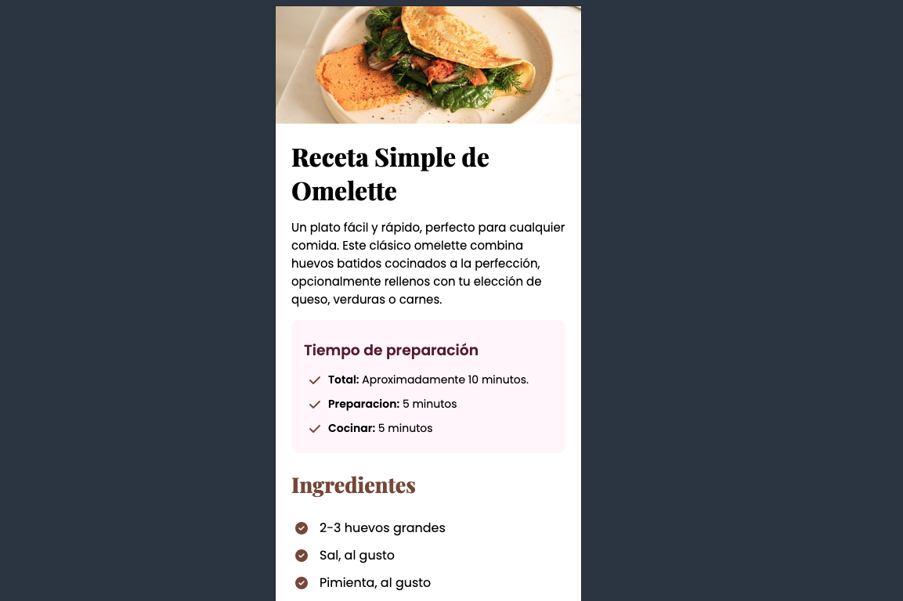

<h1 align=center>RECETA</h1>

 

Este proyecto esta orientado a mostrar una receta simple, se muestran las secciones como los ingredientes, la preparación, los tiempos y hasta un cuadro de caracteristicas sobre los alimentos.

 
 
 
 
 

<h2>Vista Escritorio</h2>

<h2>Vista Móvil</h2>
